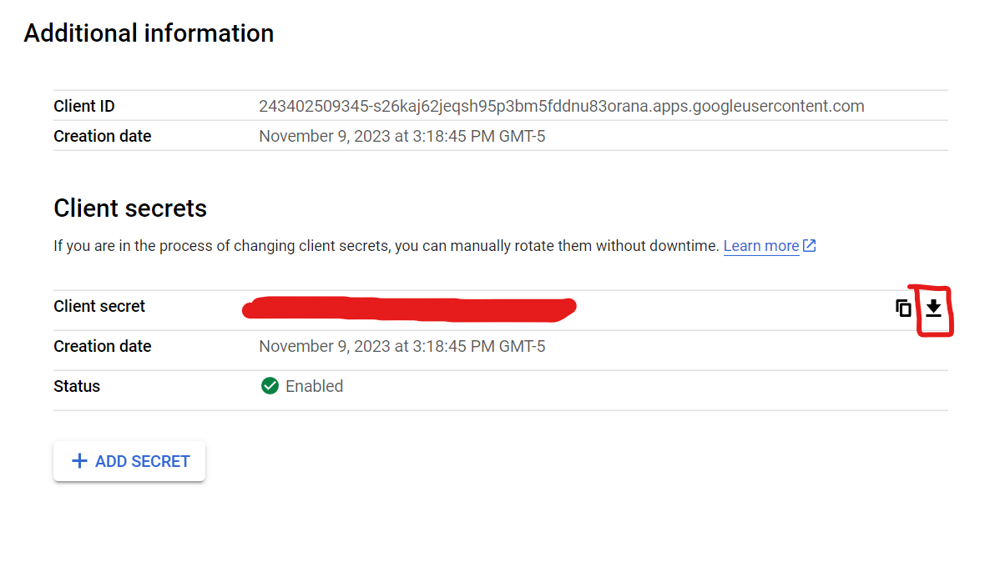

# basic_scraping_backend

## Installation

1. Clone the repository, setting up python virtual environment[^1], and then install the required libraries:
```
pip install -r requirements.txt
```
<br>

2. Create a .env file with necessary credentials and secrets

| Credentials  | Description |
| ------------- | ------------- |
| bucket_name | S3 Bucket as a data store of images |
| aws_access_key_id | id for AWS IAM User with SES access |
| aws_secret_access_key | access key for AWS IAM User with SES access |
| aws_access_key_id_s3 | id for AWS IAM User with s3_client access |
| aws_secret_access_key_s3 | access key for AWS IAM User with S3 access |
| aws_region | region of AWS service |
| jwt_secret_key | a random secrete string to sign for jwt token |
| database_string | connection string to mysql database |

<br>

3. Configure OAuth Consent Screen with ```userinfo.email```, ```userinfo.profile```, and ```openid``` scope in Google Cloud Console and create an OAuth 2.0 Client IDs in credentials page. Download the ```client_secret.json``` file[^2] and save into routers/ directory.



## running

At root directory of the app, for

Development, run

```
uvicorn main:app --reload
```

Hosting over http, run

```
uvicorn main:app --host 0.0.0.0 --port 8000
```

Hosting over https with ssl certificate (Noted that --host 0.0.0.0 is necessary for remote DNS server to connect)

```
uvicorn main:app --port 8000 --host 0.0.0.0 --ssl-keyfile=/path-to-key.pem --ssl-certfile=/path-to-cert.pem

```


## APIs

### Reddit/Twitter
| Method | Path | Description| Required API Key |
| ------------- | ------------- | ------------- | ------------- |
|   GET    |   ```/reddit/get_latest_reddit```                 |  getting reddit data | yes
|   GET    |   ```/reddit/get_latest_twitter```                 |  getting twitter data | yes

Options as query parameters
| Parameters | Options | Default | Required |
| ------------- | ------------- | ------------- | ------------- |
|   pageSize    |   Integer                             |  None | yes
|   pageNumber  |   Integer                             |  None | yes
|   sortKey     |   "created_at" \| String              |  None | no
|   sortDirect  |   "desc" \| "asc"                         |  "asc" | no
|   searchKey   |   String  |  None | no


### User profile

| Method | Path | Description| Require JWT Token |
| ------------- | ------------- | ------------- | ------------- |
|   GET    |   ```/avatar```                 |  Get presigned url for user image | Yes |


### Authorization and Authentication
#### Summary

| Method | Path | Description | Require JWT Token |
| ------------- | ------------- | ------------- | ------------- |
|   POST    |   ```/auth``` |  Create new user with local | No |
|   POST    |   ```/auth/token```           |   Login in exchange with a jwt token    | No |
|   POST    |   ```/auth/verify``` |  verify email address by sending 6 digits OTP to this endpoint | Yes |
|   POST    |   ```/auth/resend```          |   require to resend a verification emails with a new 6 digits OTP  | Yes|
|   POST    |   ```/auth/register-google``` |   register or login with info getting from google oauth2[^3] | No

<br>
<br>

| Method | Path | Description |
| ------------- | ------------- | ------------- |
|   POST    |   ```/auth```                 |   Create new user with local password strategy |

JSON Example
```
{
  "username": "exampleuser",
  "email": "exampleuser@example.com",
  "password": "Aa123321!!",
  "role": "user",
  "image_name":"avatar.png",
  "image":"iVBORw0KGgoAAAANSUhEUgAABEIAAAHiCAMAAADbOJkCAAA..."
} 
```

Return Data
```
{
    "access_token": "eyJhbGciOiJIUzI1NiIsInR5cC...",
    "token_type": "bearer",
    "user": 
    {
        "id": 1,
        "username": "exampleuser",
        "email": "exampleuser@example.com",
        "role": "user",
        "activated": false,
        "user_image": "https://...png"
    }
}

```


| Method | Path | Description | 
| ------------- | ------------- | ------------- |
|   POST    |   ```/auth/token```           |   Login in exchange with a jwt token    |

x-www-form-urlencoded form data
| Form Field |
| ------------- | 
|   username    | 
|   password    |

Return Data
```
{
    "access_token": "eyJhbGciOiJIUzI1NiIsInR5cC...",
    "token_type": "bearer",
    "user": 
    {
        "id": 1,
        "username": "exampleuser",
        "email": "exampleuser@example.com",
        "role": "user",
        "activated": false,
        "user_image": "https://...png"
    }
}
```
| Method | Path | Description | Require JWT Token |
| ------------- | ------------- | ------------- | ------------- |
|   POST    |   ```/auth/verify``` |  verify email address by sending 6 digits OTP to this endpoint | Yes |

| Query string |
| ------------- | 
|   verificationCode    | 


| Method | Path | Description| Require JWT Token |
| ------------- | ------------- | ------------- | ------------- |
|   POST    |   ```/auth/resend```          |   require to resend a verification emails with a new 6 digits OTP  | Yes
 |
|   POST    |   ```/auth/register-google``` |   register or login with info getting from google oauth2[^3] | No

JSON Example (from Google Oauth2)
```
{
    "code": "4/0AfJohXkPIRGa18QQ8TFruOa3...",
    "scope":"email profile openid 
            https://www.googleapis.com/auth/userinfo.profile 
            https://www.googleapis.com/auth/userinfo.email",
    "authuser": "0",
    "prompt": "consent"
}
```
Return Data
```
{
    "access_token": "eyJhbGciOiJIUzI1NiIsInR5cC...",
    "token_type": "bearer",
    "user": 
    {
        "id": 1,
        "username": "exampleuser",
        "email": "exampleuser@example.com",
        "role": "user",
        "activated": false,
        "user_image": "https://...png"
    }
}
```
[^1]: https://docs.python.org/3/library/venv.html
[^2]: https://developers.google.com/api-client-library/dotnet/guide/aaa_client_secrets
[^3]: https://developers.google.com/identity/protocols/oauth2/web-server#python_4